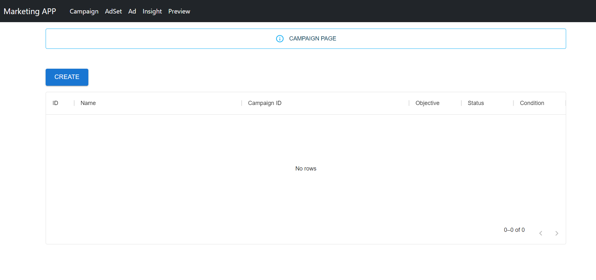
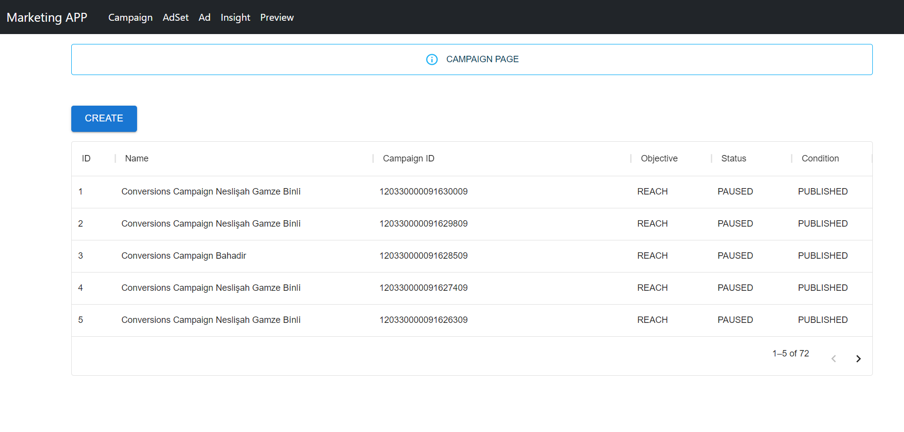
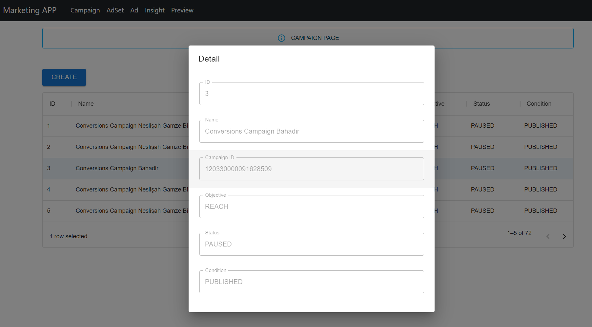
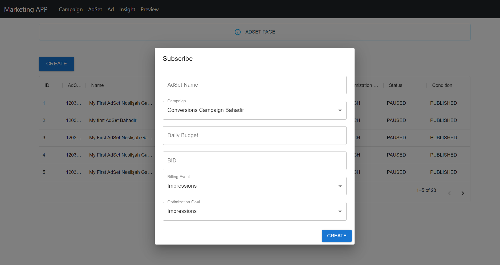

# Marketing APP

## Introduction
This is a backend of Marketing APP that is very generic. 
You don't need to write complicated Serializers and Views if not really necessary. 
This project used GenericModelSerializers and GenericApiViews

Via this app, you can create and monitor your ads on Facebook.

## Installation and Deploying
Basically, docker will install and deploy everything, you don't need extra efford.

    docker-compose up

If you add new libraries into django, you should delete the image and run compose command again.

## How to Use

#### _**BEFORE USE IT, PLEASE READ IMPORTANT NOTES**_

The application has frontend, thus after you run docker compose, you can connect http://localhost:3002/ on your browser.
There are 5 tab on the frontend. Campaign, Adset and Ad tabs for both monitoring and adding a new one.

- **When you open the page, you may see the empty rows. In this case please wait a couple of minutes.**

- **After a couple of minutes you are able to see the existing data**

- **You can click on row if you want to see detail**

- **To add new campaign, adset or ad, you can click to the add button**

## IMPORTANT NOTES
- **For Developing purposes there is no authentication system. However, it is been already implemented. See: marketing_rest_api/authentication/**
- Celery has been implemented. Thus, there are periodic tasks that retrieve, try to send again and delete failed items. It is set to 
every 1 min. So after 1 min you run the docker-compose, you will see the existing campaigns, adsets and ads.
- If celery doesn't work, check error logs. If you see the error below, then you need to refresh MY_ACCESS_TOKEN in .env.dev
    
      Error validating access token: The session has been invalidated because the user changed their password or Facebook has changed the session for security reasons.

- For Developing purposes there is no need to implement logger. print function will cover everything.
- There is no volume in db server, so if you run following command you will flush database. But don't worry! Celery will 
retrieve all via facebook_api:
        
      docker compose down
- Please disable adblocker for localhost:3002.
- For developing purposes, there is only 1 image for ads. {HOME_DIR}/api/facebook/gucci-bag.jpg

## Test

Test will be run when you run following command

    docker compose up

But, if you want to test it separately, you can list of container by

    docker ps
    docker exec -ti <container_id_of_marketing_api_app_image> bash
    python manage.py test api

## Future Works

- Error handling mechanism can be implemented
- Authentication system can be enabled. (it is ready.)
- Logger mechanism
- Update mechanism on facebook campaigns, adset, ad etc. 
- Image uploader